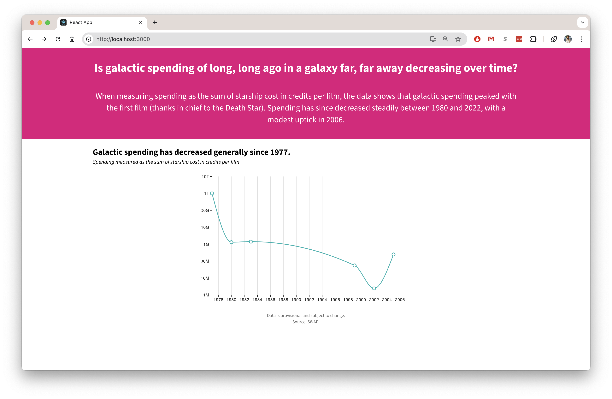

# SWAPI Spending
This repository features a simple [FastAPI](https://fastapi.tiangolo.com/) wrapper around [SWAPI](https://swapi.dev/) and a React application created from [create-react-app](https://create-react-app.dev/) and [Material UI](https://mui.com/material-ui) components.

## Running locally
# API
```
cd api
poetry install # install dependencies
fastapi dev main.py # run server, swagger docs at http://127.0.0.1:8000/docs
```


# UI
```
cd ui
npm run build # build package
npm run start # run application on localhost:3000
```

Click a data point to see more


## System Design
### Current


The API back-end is simply a wrapper around the SWAPI.  In other words, this solution is a naive middle-man that makes equivalent requests to the original API.  

The front-end is a React application.

### Improved


In an improved design, we introduce a RDBMS.  Data is ingested from SWAPI into the database using a one-time job.  This enables more performant querying for our purposes.

We might cache at the database to return the result of very common queries.  Because the SWAPI is built from anwell-known, static, unlikely to change data set, we would not have to worry about invalidating the cache.

A film repository is responsible for retrieving films and any related objects.  Optionally a film service can be used to perform any desired business logic or calculations (like calculating spending per film).  We can cache the result of common requests at the application layer as well.

The improved API exposes a GET spending endpoint that acts like a BFF (back-end for front-end).  In this way the presentation layer can be "dumb" and simply display the data.

Other considerations that I was not able to address in this project:
* docker containers
* deployment
* metrics and monitoring
* testing (unit, api, e2e)

## Known Issues
### N+1 Query Problem
Naively using the SWAPI to retrieve starships per film results in the N+1 select problem:

1. (1 query) Get all films.  The result contains all films and the starship IDs featured in those films.
2. (N queries) For each starship in each film (N), query for starship.

This is a performance problem that is easily solvable in the back-end.  By using a relational database to store films and starships as a many-to-many relationship, we can retrieve the information about related starships for a film in a single query.

### CORS
When running locally, the React app is unable to make requests to the API that is also being concurrently run locally.